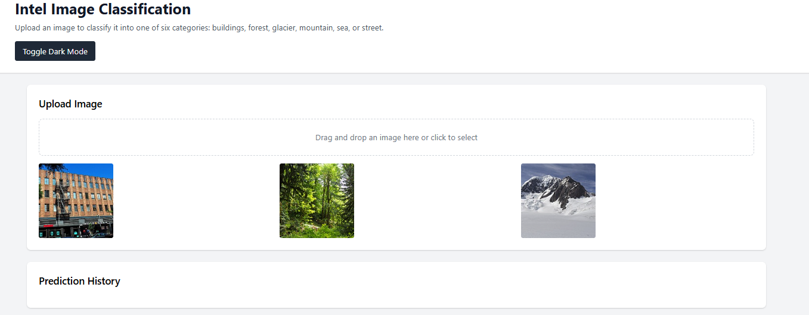
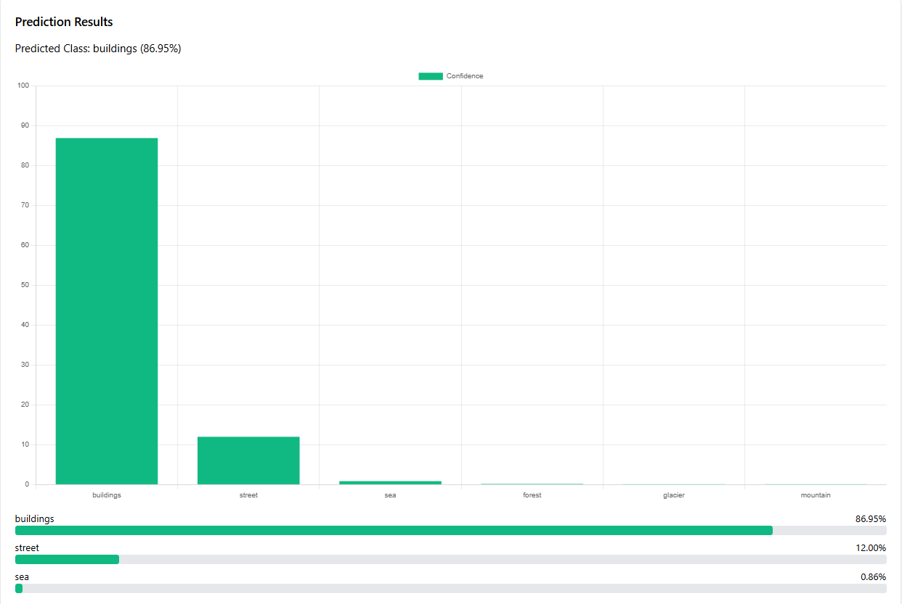

# Intel Image Classification API

A FastAPI-based web service for classifying images into six categories: buildings, forest, glacier, mountain, sea, and street. This project includes a complete machine learning pipeline with model training, REST API, and a responsive web frontend.




## Deployment

TAccess the live API documentation here:
👉 https://web-production-e69cb.up.railway.app/docs


## 🚀 Features

- **Image Classification**: Classify images into 6 predefined categories using a trained CNN model
- **REST API**: FastAPI-powered backend with automatic documentation
- **Web Frontend**: Responsive HTML/CSS/JavaScript interface with drag-and-drop upload
- **Batch Processing**: Support for classifying multiple images simultaneously
- **Model Management**: Flexible model loading and inference system
- **Logging & Monitoring**: Comprehensive logging with request tracking
- **Error Handling**: Robust error handling with detailed responses
- **CORS Support**: Cross-origin resource sharing enabled
- **Deployment Ready**: Includes Procfile for easy deployment




## 📋 Requirements

- Python 3.8+
- TensorFlow 2.15.0
- FastAPI
- Uvicorn
- PIL (Pillow)
- NumPy

## 🛠 Installation

1. **Clone the repository:**
   ```bash
   git clone <repository-url>
   cd intel-image-classification
   ```

2. **Create a virtual environment:**
   ```bash
   python -m venv venv
   source venv/bin/activate  # On Windows: venv\Scripts\activate
   ```

3. **Install dependencies:**
   ```bash
   pip install -r requirements.txt
   ```

4. **Download the trained model:**
   - Place your trained model file in `src/models/` directory
   - Update `MODEL_PATH` in `src/config.py` if needed

## 🚀 Usage

### Running the API Server

```bash
# Run with auto-reload (development)
uvicorn src.main:app --reload

# Run production server
uvicorn src.main:app --host 0.0.0.0 --port 8000
```

The API will be available at `http://localhost:8000`

### Web Interface

Open `src/frontend/index.html` in your browser or serve it through a web server.

## 📡 API Endpoints

### Core Endpoints

- `GET /` - API information and available endpoints
- `GET /health` - Health check and model status
- `POST /predict` - Single image classification
- `POST /predict-batch` - Batch image classification
- `GET /classes` - List of supported classes

### API Documentation

- Interactive API docs: `http://localhost:8000/docs`
- Alternative docs: `http://localhost:8000/redoc`

### Example API Usage

#### Single Image Classification
```bash
curl -X POST "http://localhost:8000/predict" \
     -H "accept: application/json" \
     -H "Content-Type: multipart/form-data" \
     -F "file=@image.jpg"
```

#### Response Format
```json
{
  "filename": "image.jpg",
  "class": "mountain",
  "confidence": 0.8923,
  "predictions": {
    "mountain": 0.8923,
    "glacier": 0.0456,
    "sea": 0.0321,
    "forest": 0.0189,
    "buildings": 0.0087,
    "street": 0.0024
  },
  "timestamp": "2024-01-15T10:30:00"
}
```

## 📁 Project Structure

```
intel-image-classification/
├── src/
│   ├── main.py              # FastAPI application
│   ├── config.py            # Application configuration
│   ├── model_loader.py      # Model loading and inference
│   ├── preprocessing.py     # Image preprocessing utilities
│   ├── __init__.py
│   ├── frontend/
│   │   ├── index.html       # Web interface
│   │   ├── script.js        # Frontend JavaScript
│   │   └── style.css        # Frontend styles
│   └── models/              # Trained models
│       ├── model_1_simple.h5
│       ├── model_1_simple.keras
│       └── model_1_simple_local.h5
├── Notebooks/
│   ├── 01_data_exploration.ipynb    # Data analysis notebook
│   ├── 02_model_training.ipynb      # Model training notebook
│   ├── 02_model_training_VGG.ipynb  # VGG model training
│   ├── training_history_model_1.json
│   ├── training_history_VGG.json
│   └── seg_*/                    # Dataset directories
├── requirements.txt          # Python dependencies
├── Procfile                  # Deployment configuration
├── api.log                   # Application logs
└── README.md                 # This file
```

## 🧠 Model Training

The project includes Jupyter notebooks for model training and data exploration:

### Available Notebooks

1. **`01_data_exploration.ipynb`** - Dataset analysis and visualization
2. **`02_model_training.ipynb`** - Simple CNN model training
3. **`02_model_training_VGG.ipynb`** - VGG-based model training

### Training Data

The model is trained on the Intel Image Classification dataset with 6 classes:
- Buildings
- Forest
- Glacier
- Mountain
- Sea
- Street

### Model Architecture

The default model (`model_1_simple`) is a CNN with:
- 3 Convolutional layers with batch normalization
- Max pooling and dropout for regularization
- Global average pooling
- Dense layers with softmax activation

## 🚀 Deployment

### Heroku Deployment

1. **Install Heroku CLI**
2. **Login to Heroku:**
   ```bash
   heroku login
   ```

3. **Create Heroku app:**
   ```bash
   heroku create your-app-name
   ```

4. **Deploy:**
   ```bash
   git push heroku main
   ```

### Local Deployment

```bash
# Using gunicorn (recommended for production)
gunicorn src.main:app -w 4 -k uvicorn.workers.UvicornWorker --bind 0.0.0.0:8000
```

## 🔧 Configuration

Configuration is managed through `src/config.py` using Pydantic settings:

- **API Settings**: Title, version, description
- **Server Settings**: Host, port, reload
- **Model Settings**: Model path, image size
- **File Upload**: Max file size, allowed extensions
- **Logging**: Log level, file path

Environment variables can be set in a `.env` file.

## 🧪 Testing

### API Testing

```bash
# Health check
curl http://localhost:8000/health

# Get classes
curl http://localhost:8000/classes
```

### Model Testing

```python
from src.model_loader import ModelLoader
from src.preprocessing import ImagePreprocessor
from PIL import Image

# Load model and preprocessor
model_loader = ModelLoader("src/models/model_1_simple.keras")
preprocessor = ImagePreprocessor((150, 150))

# Load and preprocess image
image = Image.open("test_image.jpg")
processed = preprocessor.preprocess(image)

# Make prediction
predictions = model_loader.predict(processed)
print(predictions)
```

## 🤝 Contributing

1. Fork the repository
2. Create a feature branch (`git checkout -b feature/amazing-feature`)
3. Commit your changes (`git commit -m 'Add amazing feature'`)
4. Push to the branch (`git push origin feature/amazing-feature`)
5. Open a Pull Request

## 📄 License

This project is licensed under the MIT License - see the LICENSE file for details.

## 📞 Contact

For questions or support, please open an issue on GitHub.

## 🙏 Acknowledgments

- Intel Image Classification Dataset
- FastAPI framework
- TensorFlow/Keras
- Open source community
